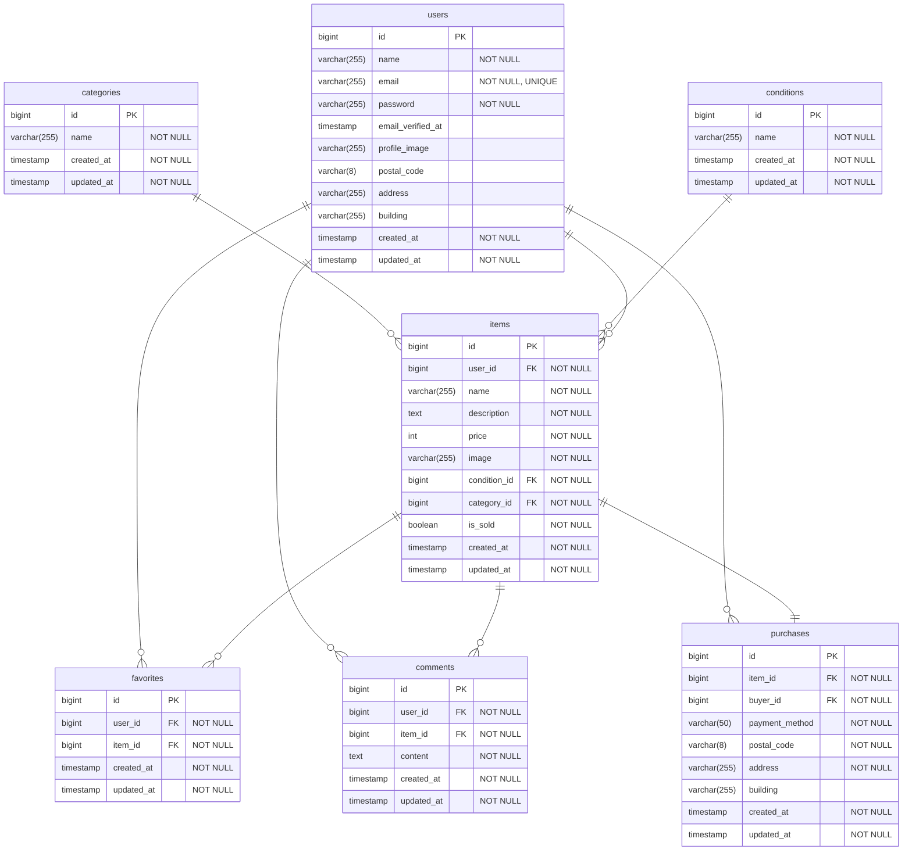

# flea-market-app

## ER図

## テーブル設計

### 1. users (ユーザー)
| カラム名 | 型 | NULL | キー | 備考 |
|---------|-----|------|------|------|
| id | bigint unsigned | NO | PK | 自動増分 |
| name | varchar(255) | NO | | ユーザー名 |
| email | varchar(255) | NO | UNIQUE | メールアドレス |
| password | varchar(255) | NO | | パスワード(ハッシュ化) |
| email_verified_at | timestamp | YES | | メール認証日時 |
| profile_image | varchar(255) | YES | | プロフィール画像パス |
| postal_code | varchar(8) | YES | | 郵便番号 |
| address | varchar(255) | YES | | 住所 |
| building | varchar(255) | YES | | 建物名 |
| created_at | timestamp | NO | | 作成日時 |
| updated_at | timestamp | NO | | 更新日時 |

### 2. items (商品)
| カラム名 | 型 | NULL | キー | 備考 |
|---------|-----|------|------|------|
| id | bigint unsigned | NO | PK | 自動増分 |
| user_id | bigint unsigned | NO | FK | 出品者ID |
| name | varchar(255) | NO | | 商品名 |
| description | text | NO | | 商品説明 |
| price | int unsigned | NO | | 価格 |
| image | varchar(255) | NO | | 商品画像パス |
| condition_id | bigint unsigned | NO | FK | 商品の状態ID |
| category_id | bigint unsigned | NO | FK | カテゴリーID |
| is_sold | boolean | NO | | 売却済みフラグ (0:未売却, 1:売却済) |
| created_at | timestamp | NO | | 作成日時 |
| updated_at | timestamp | NO | | 更新日時 |

### 3. categories (カテゴリー)
| カラム名 | 型 | NULL | キー | 備考 |
|---------|-----|------|------|------|
| id | bigint unsigned | NO | PK | 自動増分 |
| name | varchar(255) | NO | | カテゴリー名 |
| created_at | timestamp | NO | | 作成日時 |
| updated_at | timestamp | NO | | 更新日時 |

### 4. conditions (商品の状態)
| カラム名 | 型 | NULL | キー | 備考 |
|---------|-----|------|------|------|
| id | bigint unsigned | NO | PK | 自動増分 |
| name | varchar(255) | NO | | 状態名(新品、未使用に近い、など) |
| created_at | timestamp | NO | | 作成日時 |
| updated_at | timestamp | NO | | 更新日時 |

### 5. purchases (購入履歴)
| カラム名 | 型 | NULL | キー | 備考 |
|---------|-----|------|------|------|
| id | bigint unsigned | NO | PK | 自動増分 |
| item_id | bigint unsigned | NO | FK | 商品ID |
| buyer_id | bigint unsigned | NO | FK | 購入者ID(users.id) |
| payment_method | varchar(50) | NO | | 支払い方法 |
| postal_code | varchar(8) | NO | | 配送先郵便番号 |
| address | varchar(255) | NO | | 配送先住所 |
| building | varchar(255) | YES | | 配送先建物名 |
| created_at | timestamp | NO | | 作成日時 |
| updated_at | timestamp | NO | | 更新日時 |

### 6. favorites (いいね/マイリスト)
| カラム名 | 型 | NULL | キー | 備考 |
|---------|-----|------|------|------|
| id | bigint unsigned | NO | PK | 自動増分 |
| user_id | bigint unsigned | NO | FK | ユーザーID |
| item_id | bigint unsigned | NO | FK | 商品ID |
| created_at | timestamp | NO | | 作成日時 |
| updated_at | timestamp | NO | | 更新日時 |

### 7. comments (コメント)
| カラム名 | 型 | NULL | キー | 備考 |
|---------|-----|------|------|------|
| id | bigint unsigned | NO | PK | 自動増分 |
| user_id | bigint unsigned | NO | FK | ユーザーID |
| item_id | bigint unsigned | NO | FK | 商品ID |
| content | text | NO | | コメント内容 |
| created_at | timestamp | NO | | 作成日時 |
| updated_at | timestamp | NO | | 更新日時 |

## リレーション
- users → items (1対多: 1人が複数商品を出品)
- users → purchases (1対多: 1人が複数購入)
- users → favorites (1対多: 1人が複数いいね)
- users → comments (1対多: 1人が複数コメント)
- items → purchases (1対1: 1商品に1購入)
- items → favorites (1対多: 1商品に複数いいね)
- items → comments (1対多: 1商品に複数コメント)
- categories → items (1対多: 1カテゴリーに複数商品)
- conditions → items (1対多: 1状態に複数商品)